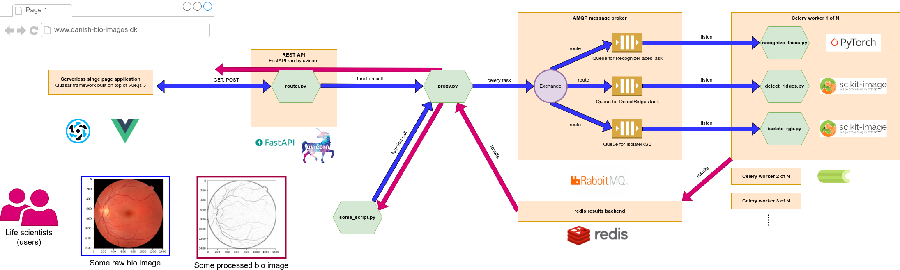

# bioimage_analysis_framework_demo
Demo application for the position Python programmer at Danish BioImaging Infrastructure Image Analysis Core Facility (DBI-INFRA IACF)


# Prerequisites

The code in this repository is only known to run on Linux but Windows and Mac should in principle work as well if below requistes are installed.

Feel free to submit an issue or drop me an email if you have problems setting things up .

1. [Python 3.10+](https://www.python.org/)
2. [poetry version 1.2.2+](https://python-poetry.org/docs/#installing-with-the-official-installer)
3. [Node 18.12.1 LTS](https://nodejs.org/en/)
4. [Docker 20.10.21+](https://docs.docker.com/get-docker/)
5. [VSCode](https://code.visualstudio.com/)


# Installation / Library download
The framework is not really installed but rather the required libraries are download using poetry and npm.
All commands have to be executed in the repository root.

Download python libraries for the virtual environment:

```
poetry install
```

Download node modules for web frontend development:

```
cd frontend
npm install
```

# Architecture


# Development

Note: Below instructions are written for a machine running Linux and VSCode as IDE. 

Generally speaking, all orange components of above architecture have to be started successively:

1. The AMQP message broker that distributes tasks amongst workers
2. The redis results backend for sending task results back to the requester
3. The celery service that executes tasks
4. The REST API that is used for communication from the browser to the service
5. The web frontend 

Then you could execute the script `run_example_analysis_via_python.sh` to see how 
everything works from python or play around with the web interface. 


## 1. AMQP broker
Open a new terminal and in the repo root and execute:

```bash
./run_rabbitmq_broker.sh
```

The management interface can be found at http://localhost:15672/ with the user/password biodude

## 2. redis results backend
Open a new terminal and in the repo root and execute:

```bash
./run_redis_result_backend.sh
```

## 3. Image processing service

Open a new terminal and in the repo root and execute:

```bash
./run_bioimage_processing_service.sh
```

To simulate another server/node just open another terminal and run the same command again.

Tasks should be evenly distributed between the two.

## 4. REST API

Open a new terminal and in the repo root and execute:

```bash
./run_rest_api.sh
```

Find the FastAPI interface at http://0.0.0.0:51337/docs

## 5. Web frontend
To start the Quasar development server do the following in VSCode:

1. Press **Ctrl+Shift+P**
2. Select **Run Task**
3. Select **quasar-dev**
4. Go to your browser and visit http://localhost:8080/

Note: the quasar-dev task is defined in .vscode/tasks

# Typescript code generation

To generate the typescript models based on the OpenAPI definition coming from FastAPI:
First start the REST API server, download the openapi.json, store in repo root and execute:

```
./generate_ts_from_openapi.sh
```